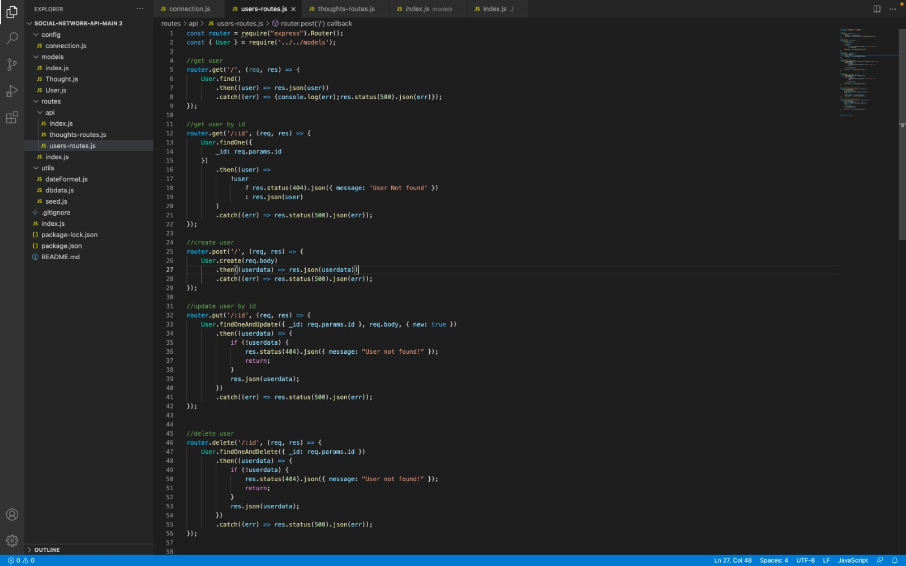
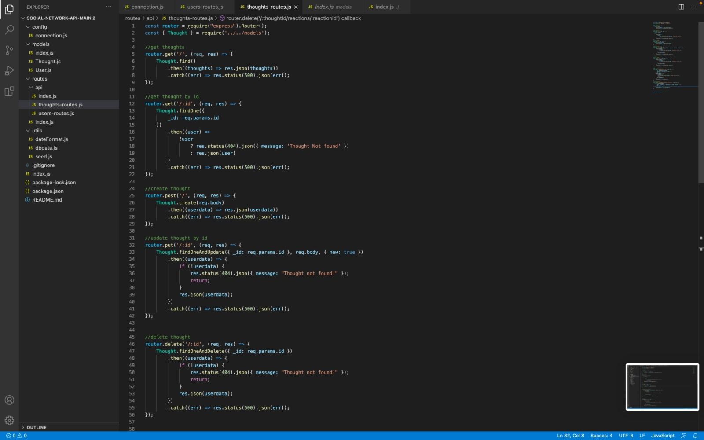
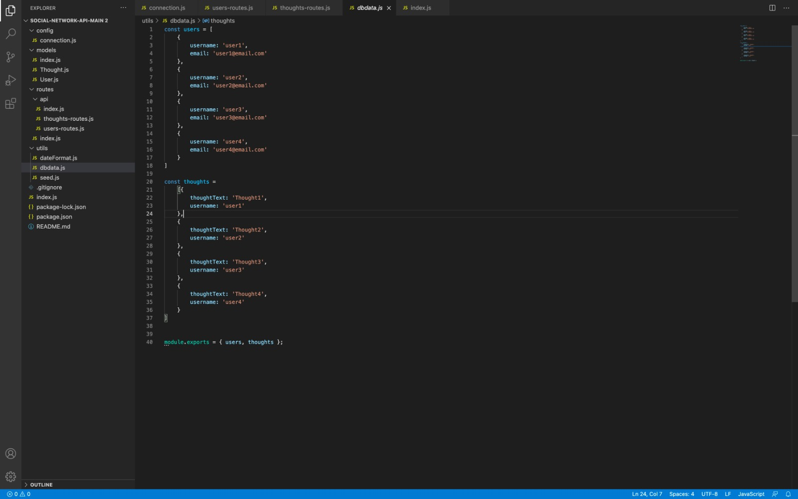
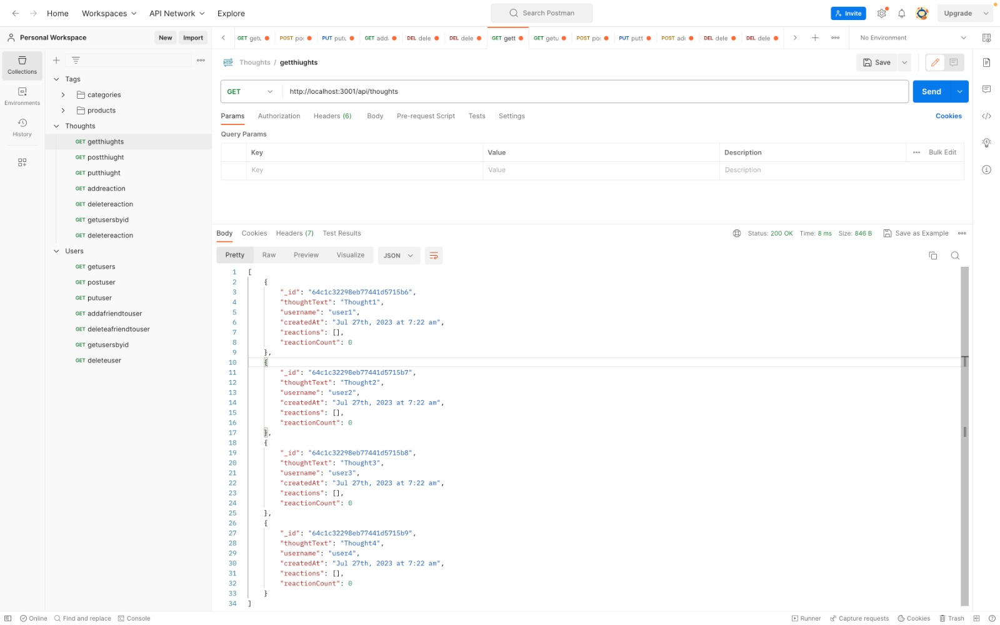

# Social Networking API

## Project Description

This application builds an API for a social network web application where users can share their thoughts, react to friends’ thoughts, and create a friend list

## Techstack

Node JS.
Express JS.
MongoDB database.
Mongoose ODM.

## Screenshots

Below screenshot shows api routes for users

Below screenshot shows api routes for thoughts

Below screenshot shows seed data for db

Below screenshot shows postman API call

## Video recording of the project

Video uploaded in below link will display how api calls are made using this project
[hhttps://drive.google.com/file/d/1cpgp-b71KM0RmROVU-NNOGYEZc3OGhax/view?usp=sharing](https://drive.google.com/file/d/1cpgp-b71KM0RmROVU-NNOGYEZc3OGhax/view?usp=sharing)

## Project Installation

To install the project follow below steps.

1. Download the project or clone this repository using git clone
2. Open terminal and run the command 'npm install'
3. Start your mongo db
4. Open terminal and run the command 'npm run seeds'
5. In terminal run the command 'npm start'

## Usage

1. Run the command 'npm start' to run the application in terminal.
2. Open Postman or Insomina.
3. Call Apis required to play with mongo db data.

## Testing
 No Test cases specified.

 ### Reach me here: 
 
 Have Queries? Reach me at
 Email : vijay.cheruku@live.com